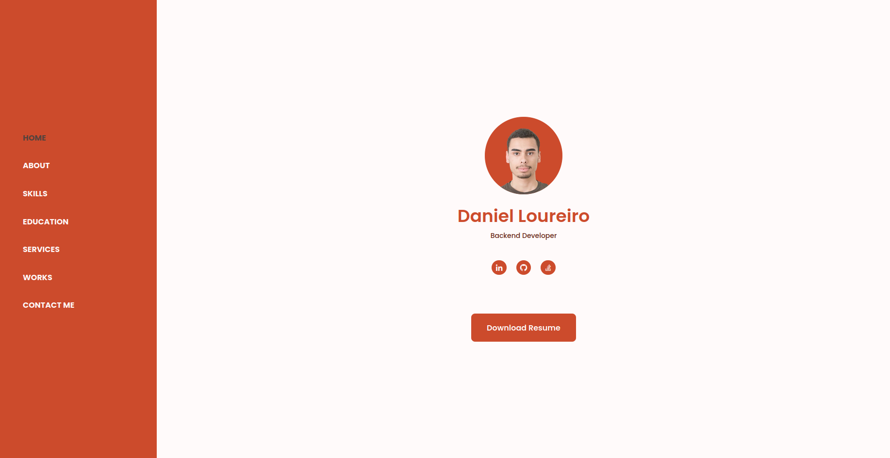

<h1 align="center">
  danielloureiro.com
</h1>

  My personal website, <a href="https://danielloureiro.com" target="_blank">danielloureiro.com</a>
   
  Built with HTML, CSS and Javascript it is hosted with <a href="https://pages.github.com/" target="_blank">GitHub Pages</a>, credits go to <a href="https://github.com/bedimcode/" target="_blank">Bedimcode</a> for the awesome website

## 🚨🚨🚨 Forking this repo (please read!)

I did not design or build this website, I merely modified it. Last I checked, [Bedimcode](https://github.com/bedimcode/) allows people to use this code, but it would be better to hear it from Bedimcode himself, at his website's [GitHub page](https://github.com/bedimcode/responsive-portfolio-complete).
